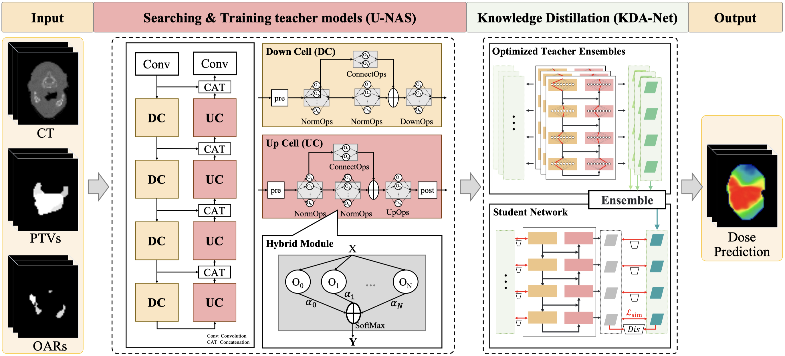
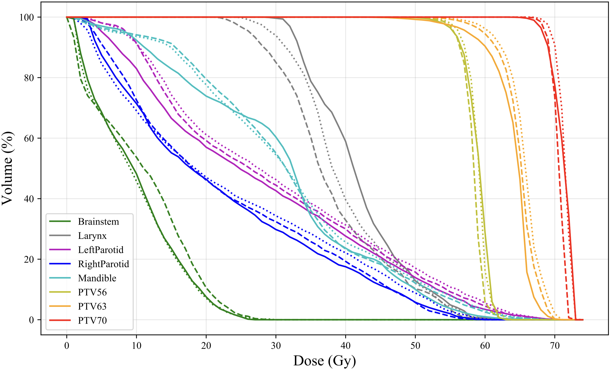

# LENAS: Learning-based Neural Architecture Search and Ensemble for 3D Radiotherapy Dose Prediction
This is the official code for our paper:

> [LENAS: Learning-based Neural Architecture Search and Ensemble for 3D Radiotherapy Dose Prediction](https://arxiv.org/abs/2106.06733) <br>
> Yi Lin*, Yanfei Liu*, Hao Chen, Xin Yang, Kai Ma, Yefeng Zheng, Kwang-Ting Cheng<br>

## Highlights
<!-- <p align="justify"> -->
- A learning-based ensemble framework, named LENAS, including the U-NAS framework which efficiently and automatically searches for optimal architectures, and a KDA-Net for the trade-off between the computational cost and accuracy.
- First place in the [AIMIS](https://contest.taop.qq.com) challenge.

<p align="center">

</p>
<!-- <p align="center"> -->
<!--  -->
<!-- </p> -->

## Usage
### Requirement
```
pip install -r requirements.txt
```

### Data preparation
* [OpenKBP](https://www.aapm.org/GrandChallenge/OpenKBP)
* [AIMIS](https://contest.taop.qq.com/channelDetail?id=108)

### Training & Evaluation
#### U-NAS
1. Prepare the data and modify the data path in `config.yml`.
```
cd /path_to_your_RTDosePrediction/RTDosePrediction/DataPrepare
python prepare_OpenKBP_C3D.py
```
2. Search the architecture.
```
python Main.py
```

#### KDA-Net
1. Training script (Take U-Net as an example).
```
cd /path_to_your_RTDosePrediction/RTDosePrediction/Unet
python train.py --batch_size 4 --list_GPU_ids 1 0 --max_iter 80000
```
2. Inference script.
```
cd /path_to_your_RTDosePrediction/RTDosePrediction/Unet
python test.py --GPU_id 0
```
- The prediction results are stored in `/path_to_your_RTDosePrediction/RTDosePrediction/Output/unet/Prediction`.

#### Details
##### Utils
- `DataPrepare`
- `DataLoader`
- `DataAugmentation`
- `NetworkTrainer`
- `Evaluate`

##### Pre-Trained
- `Teachers`: The pre-trained models used as teacher networks. `XXX.pkl` and `XXX_geno.pkl` are the weights and structures, respectively.

##### Models
- Single Model:
    - `Unet`
    - `Unet_CBAM`
    - `Vnet`
    - `FCN`
    - `DCNN`(2D)
- Cascade Models:
    - `C3D`
    - `C3D_spacing` (Resample the data in the data preparation stage)
    - `ResC3D`
    - `ResC3D_CBAM`
- NAS Manual Model:
    - `Manual_1`-`Manual_6` (See Appendix)
- NAS Single Model:
    - `NAS_18`-`NAS_42` (See Appendix)
- KD Models: 
    - `KD`
    
For each MAS Single Model, the `best_genotype.pkl` file is obtained by manually modifying the `geno.py` file and running it.

## Citation
Please cite the paper if you use the code.
```bibtex
TO BE ADDED
```
